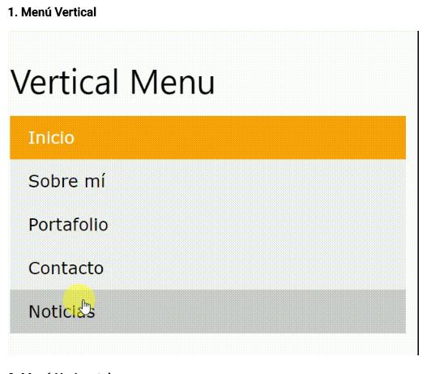

#   Menú Vertical

* **Objetivos:** _Entender a través de un caso práctico, como crear estructuras en la web con html y darle estilos con css
* **Enunciado:** _Se aplica los conceptos aprendidos para resolver problemas reales
***

